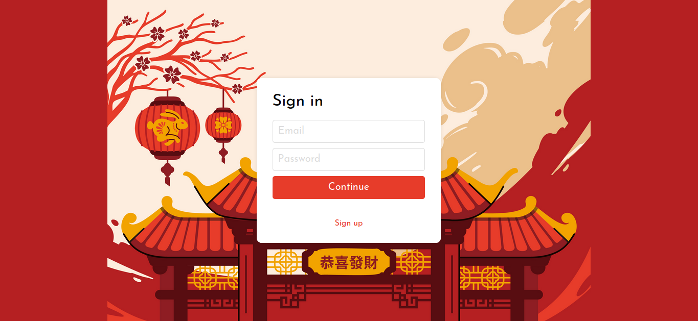
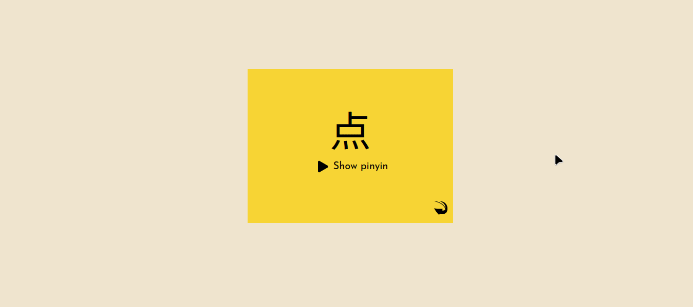

# Projeto pessoal: MemoVo


## Sobre

MemoVo é um app para treino de memorização de vocabulário. No momento o idioma disponível é o mandarim, no nível HSK 1. O sistema utilizado é o de Leitner com 12 níveis de proficiência, para memorização em flashcards. Uma explicação resumida está disponível em https://en.wikipedia.org/wiki/Leitner_system. Futuramente o projeto pode ser extendido para memorização em geral de algum conteúdo, visto que o sistema empregado não é limitado a vocabulários.


<details>
    <summary>Sign Up</summary>


</details>

<details>
    <summary>Login</summary>


</details>

<details>
    <summary>Menu</summary>


</details>

<details>
    <summary>Practice</summary>


</details>


O projeto pode ser visto em https://memovo-frontend.vercel.app/

Link para a api do projeto: https://github.com/FernandoAlmeida2/memovo-backend

## Tecnologias
Algumas das principais tecnologias e frameworks utilizados no projeto.<br/><br/>
Front-end:<br/>
<div>
    
    
    
    
    
</div>

<br/>Back-end:<br/>
<div>
    
    
    
    
    
</div>


## Como rodar o projeto

1. Clone o repositório

2. Instale as dependências
```bash
npm i
```
3. Configure o arquivo .env usando como referência o arquivo .env.example.

4. Execute o projeto
```bash
npm start
```

5. Acesse o endereço http://localhost:3000 no navegador de sua preferência.
